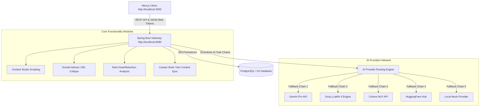

# CreatorOS AI (Creator Knowledge Operating System)

An AI-powered operating system for content creators that learns, critiques, and optimizes channel positioning, script development, and short-form video metrics. CreatorOS coordinates multiple media processing pipelines to automatically adapt content generation to a creator's unique identity, style voice, and strategic milestones.

---

## Technical Architecture Overview



---

## Expected Active Modules

The platform focuses on 5 core demo-ready operating modules:
1. **Content Studio**: Standard script outline drafts, hook variants, and visual pacing formatting.
2. **Growth Advisor**: Critique recommendations generated from YouTube channel and Instagram profile URLs.
3. **Reel Analyzer**: Uploaded short-form video critiques checking visual hook momentum, caption voice, and retention.
4. **Knowledge Hub / Creator Brain Twin**: Extraction of custom intelligence (writing style, pillars, audience targets) from documents.
5. **Workspace Management**: Switch brand identities and isolated creator databases dynamically.

---

## Tech Stack

### Frontend Client
- **Framework**: Next.js 16.2 (Turbopack) & React 19
- **State Management**: Zustand (Auth, workspaces, layout settings)
- **Styling**: Vanilla CSS with modern HSL palettes, dark glassmorphism styling, and custom scrollbars
- **Icons**: Lucide React

### Backend Service
- **Framework**: Spring Boot 3.4.3 (Java 21)
- **Concurrency**: Virtual Threads enabled (`spring.threads.virtual.enabled=true`)
- **Security**: Spring Security 6 with JSON Web Token (JWT) stateless auth filters
- **Database**: JPA / Hibernate with PostgreSQL (production) & H2 in-memory (testing)

---

## Local Development Setup

### Prerequisites
- **Java**: JDK 21+
- **Node.js**: Node 18+ (npm or yarn)
- **Environment API Keys**: Required for Fallback AI tasks (Gemini/Groq/HuggingFace)

### 1. Launch Spring Boot API Service
Navigate to the `backend/` directory:
```bash
cd backend
# Set Environment Variables and run using the Maven Wrapper:
JAVA_HOME=/path/to/jdk-21 \
GEMINI_API_KEY="your-gemini-key" \
GROQ_API_KEY="your-groq-key" \
HF_API_KEY="your-huggingface-key" \
COHERE_API_KEY="your-cohere-key" \
./mvnw spring-boot:run -Dspring-boot.run.profiles=test
```
*Note: The `-Dspring-boot.run.profiles=test` flag initializes an in-memory H2 database, making it immediately ready for testing.*

### 2. Launch Next.js Web Client
Navigate to the root directory:
```bash
# Install package dependencies
npm install

# Run the Next.js development server
npm run dev
```
Open **[http://localhost:3000](http://localhost:3000)** in your browser to view the client.

---

## Required Environment Variables

To run the AI pipeline with fallbacks, define these variables in your running environment:

| Variable Name | Description | Used by Module |
|---|---|---|
| `GEMINI_API_KEY` | Google Gemini developer key | Growth Advisor, Script Generation |
| `GROQ_API_KEY` | Groq console developer token | Content Studio, Script Variants |
| `HF_API_KEY` | Hugging Face Hub token | Reel Analyzer video metadata parsing |
| `COHERE_API_KEY` | Cohere API token | Knowledge base text classification |
| `JWT_SECRET` | Secret signature string (Base64) | Spring Security stateless auth |
| `SPRING_DATASOURCE_URL` | PostgreSQL Connection string (Optional) | Persistent Database storage |
