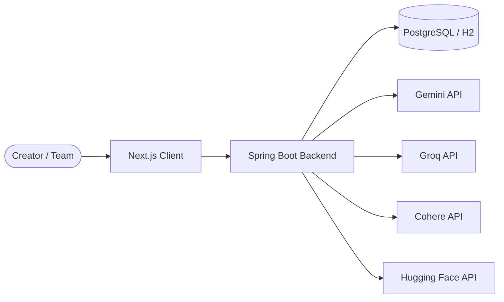
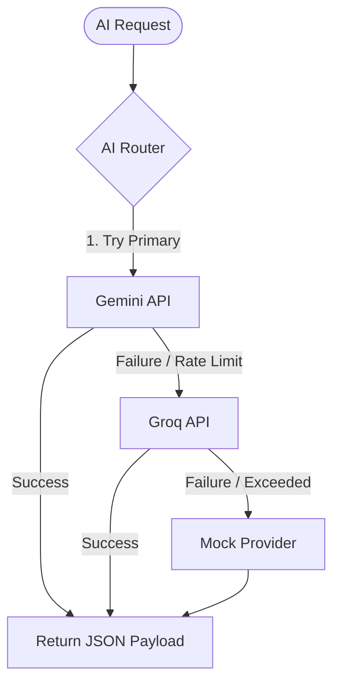
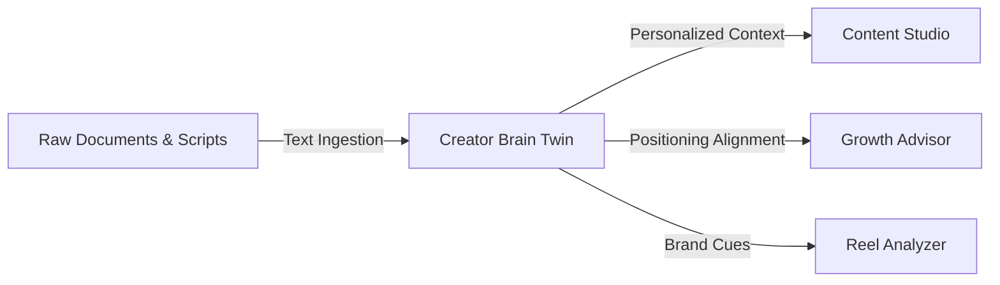
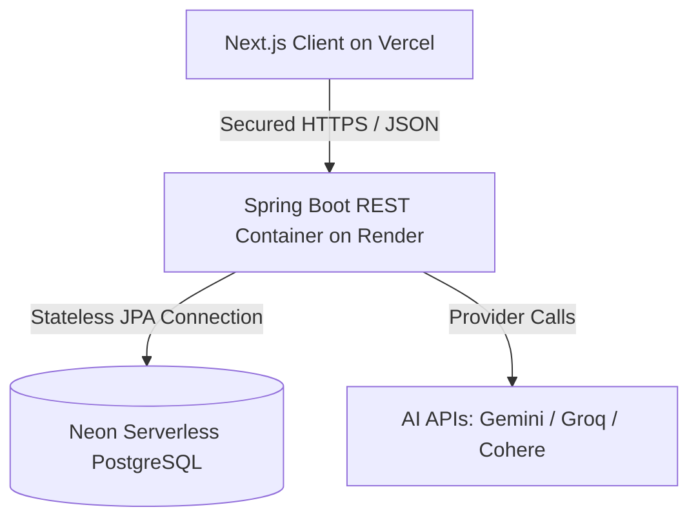

# CreatorOS.AI

### An AI-Native Operating System for Modern Creators

CreatorOS centralizes content creation, growth intelligence, creator knowledge management, and AI-powered analysis into a unified workspace designed for creators, personal brands, and media businesses.

---

## Key Capabilities

- AI-Powered Content Studio
- URL-Based Growth Advisor
- Reel & Short-Form Analyzer
- Creator Brain Twin
- Knowledge Hub
- Multi-Provider AI Routing
- Workspace-Based Creator Management

---

## Why CreatorOS Exists

The creator economy has grown rapidly, yet creators and operational teams face severe workflow fragmentation and a lack of custom intelligence.

### Core Pain Points
* **Generic AI Tools:** Off-the-shelf LLMs lack brand context, resulting in generic script drafts, captions, and strategies that fail to capture the creator's distinct voice, tone, and positioning.
* **Fragmented Creator Workflows:** Scaling a brand requires switching between disconnected tools for writing scripts, tracking metrics, analyzing short-form clips, and managing research documents.
* **Lack of Creator-Specific Intelligence:** Current growth analytics focus on raw post-publication numbers without providing actionable qualitative insights into branding, positioning alignment, or content gaps.
* **Ad-Hoc Content Strategy Analysis:** Creators struggle to analyze why specific formats work or how to adapt concepts systematically across different distribution channels.
* **No Centralized Knowledge Base:** Personal research archives, scripts, templates, and style guides are scattered across cloud drives, preventing AI models from drawing on a unified knowledge source.

---

## Product Vision

CreatorOS.AI was engineered to solve these fragmentation and personalization issues by achieving the following technical objectives:
* **Establish an AI-Native Creator OS:** Build a centralized dashboard combining script generation, growth advisory, short-form analysis, and knowledge management.
* **Centralize Content & Knowledge Pipelines:** Build tools to ingest raw research documents and compile them into a unified "Creator Brain Twin" style profile.
* **Deliver Context-Driven Personalization:** Pass the extracted Creator Brain profile dynamically into all content generation and advisory tasks to eliminate generic outputs.
* **Engine Resilient Service Availability:** Design a multi-provider fallback routing architecture that remains highly available despite rate limits or provider downtime.

---

## Architecture & Engineering

### High-Level Architecture
The platform is built as a decoupled SPA-API architecture. The Next.js client handles state management and user interactions, while the Spring Boot backend orchestrates database operations, document ingestion, and multi-provider AI tasks.



### AI Routing Layer
To guarantee resilience and continuous service availability, the AI Router processes requests using a sequential fallback strategy: attempting the primary provider, failing over to secondary providers upon error, and finally falling back to a local mock provider.



### Creator Intelligence Flow
Raw style guides, text documents, and transcript assets are parsed in the Knowledge Hub to compile a structured Brain Twin profile. This profile context is injected into all downstream creator modules.



---

## Technical Architecture & Design

### Frontend Client (Next.js + TypeScript)
* **Framework:** Next.js (App Router) utilizing React Server Components (RSCs) for static marketing routes, and client-side rendering for the interactive dashboard workspace.
* **State Management:** Zustand for lightweight, reactive global store management (auth session state, active workspace contexts, and toast queues).
* **Styling & Motion:** Vanilla CSS styling coupled with Tailwind primitives and Framer Motion for premium micro-animations, glassmorphism UI components, and transitions.

### Backend Gateway (Spring Boot)
* **Framework:** Spring Boot 3.4.3 built on Java 21, leveraging Virtual Threads (Project Loom) to process high-throughput concurrent I/O requests.
* **Security:** Stateless security architecture powered by JWT (JSON Web Tokens) with standard filters verifying requests against active workspace boundaries.
* **Rest Client:** Spring's modern `RestClient` for low-overhead, synchronous HTTP calls to downstream AI providers and scrapers.

### Database Layer
* **Production:** Neon Serverless PostgreSQL providing auto-scaling database instances with schema migrations managed via Hibernate JPA.
* **Local/Testing:** In-memory H2 database to support zero-dependency local testing profiles and fast unit tests execution.

### AI Routing & Provider Strategy
* **Abstraction:** AI services are decoupled from business services using the `AiProvider` interface, allowing unified task execution via `AiTaskType`.
* **Resilience Fallback:** The `AiProviderRouter` captures connection limits, auth failures, and server errors (e.g. 429/503) to switch dynamically to backup providers.
* **JSON Schema Enforcement:** Every request forces strict schema rendering (using `json_object` configurations) to ensure outputs conform to backend DTO expectations.

---

## Core Platform Modules

#### Content Studio
A structured markdown editor canvas that enables conceptualizing, drafting, and refining video script drafts. It translates concepts into multi-angle scripts featuring visual camera directions, pacing suggestions, and dynamic hook options.

#### Growth Advisor
An automated positioning auditor. It extracts profile metadata from public YouTube or Instagram URLs and returns detailed branding critiques, bottleneck analyses, and actionable 30-day week-by-week roadmaps.

#### Reel Analyzer
A diagnostic workbench designed to evaluate short-form video files before publishing. It grades immediate 3-second hook momentum, predicts viewer retention drops, audits calls-to-action, and calculates a total algorithmic index.

#### Knowledge Hub
An asynchronous file ingestion center. It allows creators to upload research materials, templates, and raw transcripts. The backend extracts clean text corpuses, tracks document statistics, and prepares the corpus for style parsing.

#### Creator Brain Twin
The platform’s personalization core. It scans the aggregated Knowledge Hub text corpus to extract a structured profile summarizing communication style, writing tone, signature vocabulary, and target audience profiles. This context is injected dynamically into all AI generations.

---

## Architectural Decisions

* **Spring Boot for Backend Gateway:** Spring Boot provides a mature, type-safe ecosystem with robust dependency injection, JPA database modeling, and declarative security filters. It easily integrates enterprise integrations while keeping low memory usage.
* **Next.js with React & TypeScript:** Next.js simplifies routing and static optimization. Using TypeScript on the frontend prevents runtime schema mismatches when handling complex, multi-provider JSON payloads.
* **Abstracted Providers with Fallback Routing:** AI services are highly volatile (subject to rate limits, model updates, and transient server errors). Decoupling them through a service router ensures the core application remains operational even during third-party outages.
* **PostgreSQL Database:** PostgreSQL offers transactional integrity (ACID compliance) and advanced relational modeling. This is crucial for isolated workspace context mappings and nested relationships.

---

## Technical Challenges & Future Scalability

### Current Bottlenecks
* **Public Scraping Limits:** Programmatic web scraping of YouTube and Instagram handles is limited by anti-bot consent screens and login walls. This causes the system to rely on logical fallback options (`PROFILE_ONLY` mode).
* **LLM Generation Latency:** Generating deep-dive content scripts and detailed roadmap audits can take 3–7 seconds. This impacts synchronous REST response times.
* **API Quota Restrictions:** High volume workspace analysis can easily hit hourly token and request quotas on premium LLM API tiers.
* **Client-Side PDF Generation:** Converting complex formatted markdown scripts with nested list styles into PDF layouts using JS libraries can sometimes lead to layout variations across different screen widths.

### Future Improvements
* **Background Job Queues:** Move video parsing and extensive channel critique pipelines to background worker queues (e.g., using RabbitMQ or spring-scheduling threads).
* **Vector Database Ingestion:** Integrate a vector search engine (e.g., pgvector) to perform semantic retrieval over large creator knowledge bases instead of loading full text corpuses.
* **Caching Layer:** Add Redis to cache generated growth reports and static workspace analytics, reducing redundant model requests.
* **Multi-Tenant Scalability:** Transition workspace isolation keys to database-level tenant routing schemas to scale across enterprise creator agencies.

---

## Outcomes & Impact

* **Production Deployment Readiness:** Configured and compiled target packages with multi-stage Docker build architectures, executing 43 backend verification tests cleanly under an integrated test suite.
* **AI Routing Resilience:** Built a resilient gateway that handles rate-limiting and connection failures by auto-failing over to groq models or mock profiles without session drops.
* **Personalization Capabilities:** Personalizes content drafts and strategic audits by extracting brand voice styles and document pillars asynchronously.
* **Workspace Architecture:** Establishes isolated data scopes matching teams and brands across partitioned schema structures.
* **Production Stability:** Delivered robust sticky layouts, auto-wrapping visual outputs, and stable export options.

---

## Tech Stack

* **Frontend:** React 19, Next.js 16.2, TypeScript, Zustand, Framer Motion, Tailwind CSS
* **Backend:** Java 21, Spring Boot 3.4.3, Hibernate, Spring Security, Maven
* **Database:** PostgreSQL (Neon Serverless), H2 Database (Local Testing)
* **Deployment:** Vercel (Frontend), Render Web Service with Docker (Backend)

---

## Project Structure

```text
creator-os/
├── src/                    # Next.js Web Client Source
│   ├── app/                # Next.js App Routing Pages
│   │   ├── dashboard/      # Creator Workspace Modules (Content, Growth, Hub)
│   │   ├── features/       # Dynamic marketing feature sections
│   │   └── page.tsx        # Dashboard Landing View
│   ├── components/         # Reusable UI & Layout components
│   └── lib/                # API clients & Zustand state stores
│
├── backend/                # Spring Boot Service Source
│   ├── src/main/java/      # Core API application packages
│   │   └── com/creatoros/api/
│   │       ├── controller/ # REST Gateways (Auth, Workspace, Growth, Content)
│   │       ├── model/      # Database JPA Entities
│   │       ├── repository/ # JPA repositories
│   │       ├── security/   # JWT configuration and auth filters
│   │       └── service/    # Business services and AI Providers (Gemini, Groq)
│   ├── Dockerfile          # Multi-stage Docker packaging configuration
│   └── pom.xml             # Maven dependencies list
```

---

## Local Development Setup

### 1. Run the Backend API
Prerequisite: Install Java JDK 21+ and Maven.
Navigate to the `backend/` directory:
```bash
cd backend

# Run the app locally utilizing the H2 in-memory profile.
# Provide your active developer API keys in the context:
GEMINI_API_KEY="your_api_key" \
GROQ_API_KEY="your_api_key" \
HF_API_KEY="your_api_key" \
COHERE_API_KEY="your_api_key" \
./mvnw spring-boot:run -Dspring-boot.run.profiles=test
```
The API server will launch at **`http://localhost:8080`**.

### 2. Run the Next.js Client
Prerequisite: Install Node.js 18+.
Navigate to the root directory in a new terminal:
```bash
# Install dependencies
npm install

# Run the dev server
npm run dev
```
The Next.js client will launch at **`http://localhost:3000`**.

---

## Environment Variables

The backend API configures these primary environment keys in production. Populate them inside your deployment configuration:

```env
# AI API Provider Keys
GEMINI_API_KEY=
GROQ_API_KEY=
HF_API_KEY=
COHERE_API_KEY=

# Production Database Configurations
SPRING_DATASOURCE_URL=
SPRING_DATASOURCE_USERNAME=
SPRING_DATASOURCE_PASSWORD=

# Security Config
JWT_SECRET=
```

---

## Deployment Architecture

The production environment is split across Vercel, Render, and Neon to ensure fast load times, automated scaling, and stateless hosting.



* **Frontend Hosting:** Deployed to **Vercel** for fast edge loading, custom domains, and zero-config caching.
* **Backend Gateway:** Deployed to **Render** as a Dockerized web service running on Java JDK 21.
* **Database Hosting:** Hosted on **Neon** serverless PostgreSQL, providing automatic scale-to-zero compute instances.

---

## Lessons Learned

* **AI Providers Fail Unpredictably:** Model updates, API quota limits, and server-side errors require programmatic resilience layers.
* **Fallback Routing is Essential:** A robust fallback mechanism (Gemini -> Groq -> Mock) ensures that user sessions remain interactive and unbroken.
* **Creator Personalization Matters More Than Raw AI Generation:** High-value content is built on specific brand context (style, DNA, target audience goals) rather than generic prompts.
* **Knowledge-Driven Systems Outperform Generic Prompting:** Loading custom reference documents and analyzing style DNA produces vastly superior script outcomes.
* **Production Readiness Requires Simplification and Scope Control:** Keeping database, security, and rendering layers simple reduces operational overhead and guarantees long-term application stability.
