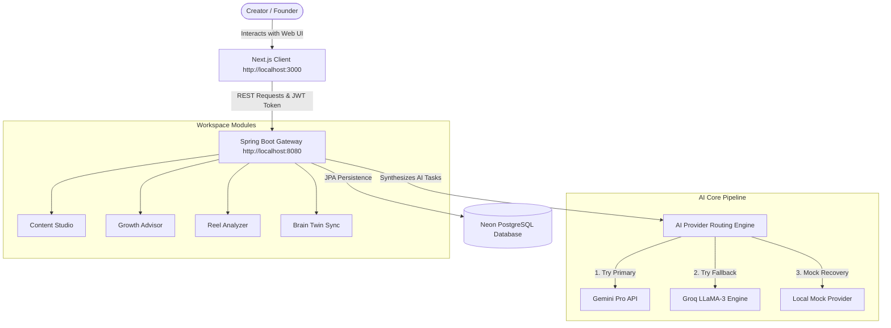
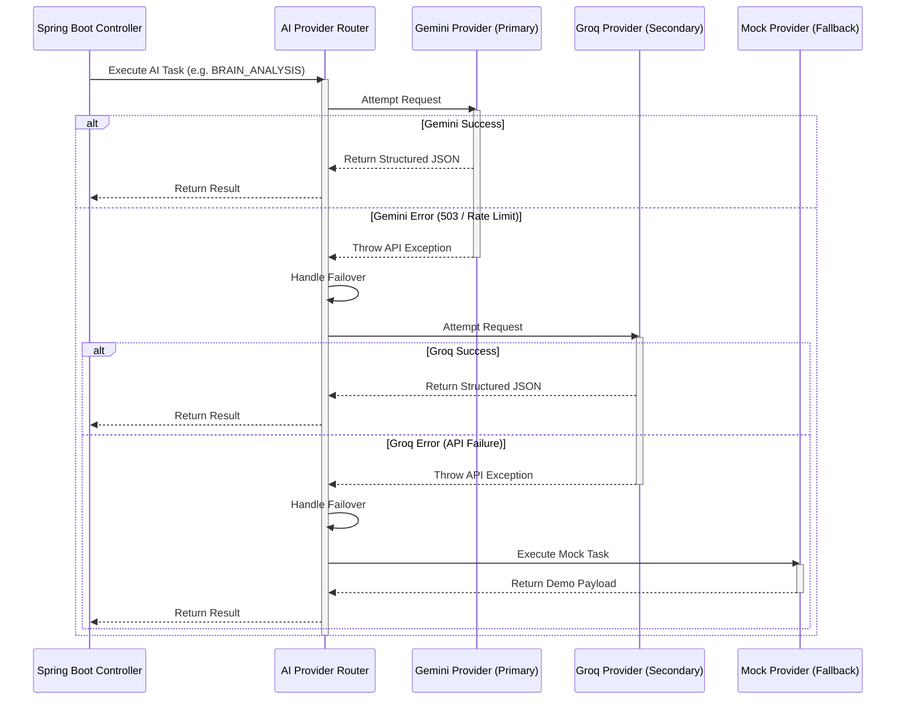

# CreatorOS AI — AI Operating System for Creators

An integrated, enterprise-grade AI operating system built to streamline media production pipelines, automate growth analytics, optimize short-form video performance, and maintain creator style voice consistency.

---

## 1. Executive Overview

CreatorOS is an **AI-first platform** designed to solve the workflow fragmentation holding back modern creators. Today, scaling a brand requires jumping between isolated tools for scriptwriting, audience metrics, short-form analysis, and document databases. This context-switching slows down output and leads to inconsistent branding.

CreatorOS consolidates these tasks into a single dashboard. By combining text trend extraction, public channel scrapers, video metrics parsing, and creator profile synchronization, the platform acts as a digital consultant that helps creators build a predictable path to growth.



---

## 2. Product Vision

CreatorOS is built on the philosophy of **AI-native creator workspaces**. Instead of generating generic AI content, the system learns continuously from the creator’s historical documents, templates, and tone guides. Every generated script, caption critique, or positioning report is custom-tailored to the brand's DNA.

By treating AI as an integrated collaborator rather than a simple chatbot, CreatorOS empowers founders to automate administrative overhead and focus on creative presentation and brand connection.

---

## 3. Feature Overview

### 📝 Content Studio
A professional scriptwriting canvas that translates content concepts into production-ready scripts:
- **Goal-Driven Script Generation**: Draft scripts aligned with specific engagement objectives (educational, entertainment, sales conversion).
- **Multiple Content Angles**: Output diverse angles for the same topic to test different audience segments.
- **Scroll-Stopping Hooks**: Generate high-retention script intros based on viral hook templates.
- **Camera & Pacing Cues**: Automatically format scene guides, camera pacing recommendations, and graphic overlays.

### 📈 Growth Advisor
An automated consultant that critiqes channel positioning using public profiles:
- **URL Analysis**: Paste any public YouTube channel URL or Instagram profile URL (no authentication required).
- **Positioning Critiques**: Analyze branding clarity, target audience alignment, and content formatting.
- **30-Day Action Blueprints**: Generate a week-by-week growth strategy detailing content format priorities and CTR advice.
- **Out-of-Sync Detection**: Detect if your profile needs a rebuild when documents are uploaded or deleted.

### 🎥 Reel Analyzer
A short-form video optimization workbench to inspect clips before publishing:
- **Video Upload Analysis**: Upload video files to analyze visual pace, intro hook contrast, and caption timing.
- **Hook Evaluation**: Scores visual and audio momentum within the critical initial 3 seconds.
- **Retention Forecasting**: Predicts viewer drop-off points based on speech pacing and visual transitions.
- **CTA Optimization**: Analyzes on-screen call-to-actions to maximize subscriber conversions.
- **Viral Potential Scoring**: Computes a total score mapping current feed algorithm trends.

### 🗄️ Knowledge Hub
A secure document vault to catalog the creator's raw research:
- **Document Ingestion**: Upload research papers, transcripts, script archives, and brand style guides (PDF, TXT, DOCX formats).
- **Semantic Text Extraction**: Extract clean content corpuses, tracking character counts and word distributions.
- **Asynchronous Sync**: Upload and manage files in a clear status grid (Uploading, Processing, Ready).

### 🧠 Creator Brain Twin
The central intelligence engine that personalizes the entire operating system:
- **Style Ingestion**: Analyze knowledge bases to extract communication tone, vocabulary, and preferred emojis.
- **Identity Extraction**: Define the creator’s mission, vision, niche positioning, and audience targets.
- **DNA Generation**: Capture signature writing structures and formatting habits.
- **Personalization Engine**: Inject the compiled intelligence profile context directly into all Content Studio drafts, Growth Advisor critiques, and Reel Analyzer reports.

---

## 4. AI Architecture & Fallback Pipeline

To ensure high availability and prevent rate-limit bottlenecks, CreatorOS implements a robust **AI Provider Routing System**:



### AI Routing Strategy
- **Resilience**: If the primary Gemini model encounters API limits, the router automatically falls back to Groq LLaMA-3. If Groq fails, the system switches to the Mock Provider to ensure the UI remains interactive and functional.
- **Strict Schema Enforcement**: Both providers construct payloads in strict JSON formats (utilizing `json_object` configurations) to guarantee parsing stability.

---

## 5. Technology Stack

| Layer | Technology | Details |
|---|---|---|
| **Frontend** | React 19, Next.js 16.2 (App Router) | High-performance client with Zustand state management and Framer Motion layouts. |
| **Backend** | Java 21, Spring Boot 3.4.3 | REST gateway running on Java Virtual Threads for low latency. |
| **Database** | PostgreSQL, Neon DB, H2 | H2 memory database for local test profiles; Neon PostgreSQL for production. |
| **AI Processing** | Gemini API, Groq, Cohere, Hugging Face | Multi-provider AI pipeline using API keys. |
| **Deployment** | Vercel (Frontend), Render (Backend Container) | Next.js deployed on Vercel; Java Docker image deployed on Render. |

---

## 6. Project Directory Structure

```text
creator-os/
├── src/                    # Next.js Web Client Source
│   ├── app/                # App Routing Directory
│   │   ├── dashboard/      # Main workspace pages (Content, Growth, Knowledge, etc.)
│   │   ├── features/       # Dynamic marketing feature details ([id])
│   │   └── page.tsx        # Responsive landing page
│   ├── components/         # Reusable UI & Layout components
│   │   └── landing/        # Custom sections (Hero, Superpowers, FAQ, Footer)
│   └── lib/                # API communication clients & Zustand stores
│
├── backend/                # Spring Boot Java Service Source
│   ├── src/main/java/      # Core application packages
│   │   └── com/creatoros/api/
│   │       ├── controller/ # REST Endpoints (Auth, Workspace, Knowledge, etc.)
│   │       ├── model/      # JPA Entity definitions (Workspace, BrainProfile, etc.)
│   │       ├── repository/ # Database JpaRepository interfaces
│   │       ├── security/   # JWT filters and UserDetails configurations
│   │       └── service/    # Business services and AI Providers (Gemini, Groq)
│   ├── Dockerfile          # Multi-stage Docker builder script
│   └── pom.xml             # Maven Project dependencies
```

---

## 7. Product Screenshots

| Interface | Preview Placeholder |
|---|---|
| **Landing Page** |  |
| **Workspace Overview** |  |
| **Content Studio** |  |
| **Growth Advisor** |  |
| **Knowledge Hub** |  |

---

## 8. Local Development Setup

### 1. Setup Backend (Spring Boot API)
Ensure you have **Java JDK 21+** installed.
Navigate to the `backend/` directory:
```bash
cd backend

# Build and run the app with active test profile (runs H2 in-memory DB)
# Set your API keys in the environment:
GEMINI_API_KEY="your_key" \
GROQ_API_KEY="your_key" \
HF_API_KEY="your_key" \
COHERE_API_KEY="your_key" \
./mvnw spring-boot:run -Dspring-boot.run.profiles=test
```
The API server will launch at **`http://localhost:8080`**.

### 2. Setup Frontend (Next.js Client)
Navigate to the root directory in a new terminal:
```bash
# Install node packages
npm install

# Run dev server
npm run dev
```
The client will launch at **`http://localhost:3000`**.

---

## 9. Production Deployment Guide

### Neon Database
1. Create a PostgreSQL project on Neon.
2. Select standard pooled settings and copy your connection string (`postgresql://...`).

### Render (Backend Deployment)
1. Create a new **Web Service** on Render.
2. Link your GitHub repository.
3. Configure the settings:
   - **Language**: Select `Docker`.
   - **Root Directory**: `backend`.
4. Add the environment variables:
   - `SPRING_DATASOURCE_URL` = `jdbc:postgresql://<your_neon_host>/neondb?sslmode=require` (make sure it starts with `jdbc:`)
   - `SPRING_DATASOURCE_USERNAME` = your database username
   - `SPRING_DATASOURCE_PASSWORD` = your database password
   - `JWT_SECRET` = your Base64-encoded signing key (e.g. `openssl rand -base64 32`)
   - Add your Gemini, Groq, HF, and Cohere keys.
5. Deploy. Render reads the `Dockerfile` to package and run the Spring Boot app on port `10000`.

### Vercel (Frontend Deployment)
1. Add a new project on Vercel and import your repository.
2. Configure **Environment Variables**:
   - `NEXT_PUBLIC_API_URL` = `https://<your-backend-render-app>.onrender.com`
3. Click **Deploy**.

---

## 10. Current Status & Roadmap

### Active in Production Today
* **Zero-Trust JWT Security**: Encrypted stateless cookies handling secure workspace auth.
* **Fallback AI Task Chains**: Resilient routing resolving script drafting and profile analysis.
* **Creator Brain Twin Ingestion**: Asynchronous document text parsing mapping metrics (word counts) and extracting voice patterns.
* **Workspace separation**: Isolated data structures protecting creators' assets.

---

### Built and Designed by **Nataraj EL**
