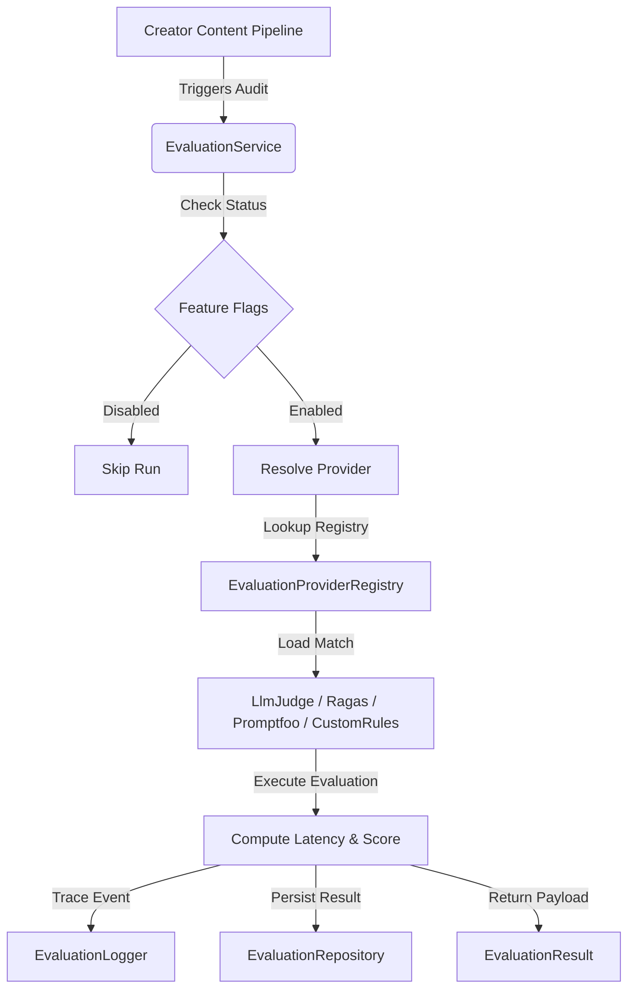

# AI Evaluation Platform Foundation (Sprint 1)

This documentation describes the architecture, type contracts, and roadmap for the modular, extensible AI Evaluation Platform running on the CreatorOS client workspace.

---

## Architecture Overview

The AI Evaluation Platform is designed as a decoupled, dependency-injected system that runs audits across different execution stages (generation, retrieval, prompt formatting, context processing, memory, and multi-turn conversations) without blocking the primary user loops.



---

## Core Components

### 1. Unified Types & Enums (`src/ai/evaluation/types/`)
* **`EvaluationStage`**: An enum representing the target pipeline layer (e.g. `GENERATION`, `RETRIEVAL`, `MEMORY`, `CONTEXT`, `PROMPT`, `CONVERSATION`).
* **`EvaluationStatus`**: Track progress state: `PENDING`, `RUNNING`, `COMPLETED`, `FAILED`, `SKIPPED`.
* **`EvaluationMetric`**: Extensible interface tracing numeric `score`, `weight`, `confidence`, and textual `reason` for safety, consistency, or custom rules.
* **`EvaluationContext`**: Unified request tracking metadata containing `requestId`, `creatorId`, `sessionId`, `pipelineId`, `provider`, `model`, and `metadata`.
* **`EvaluationRepository`**: Interface abstraction for persistence (Neon PostgreSQL or local databases).
* **`EvaluationLogger`**: Logger abstraction to record lifecycle events (started, completed, failed) inside standard JSON buffers.

### 2. Provider Registry (`src/ai/evaluation/providers/`)
The registry provides mapping for registering and checking model support:
* **`supports(stage)`**: Finds all providers supporting the designated stage.
* **`defaultProvider()`**: Returns the default fallback provider (`LLM-Judge`).
* Exposes default provider implementations:
  1. **`LLM-Judge`**: LLM-as-a-judge checking tone-consistency and safety.
  2. **`Promptfoo`**: Assertion constraints and prompt boundaries validation.
  3. **`Ragas`**: Faithfulness, context recall, and retrieval audits.
  4. **`Custom-Rules`**: Lightweight token limits, link checking, and regex checks.

### 3. Service Layer (`src/ai/evaluation/services/`)
The central coordinator exposing the `evaluate(context, config)` method:
* Runs feature flag checks (`EVAL_ENABLED` and stage-level flags).
* Traces start/success/failure metrics and overall latency.
* Executes provider computations, catches custom errors (`ValidationError`, `ProviderError`), and persists result DTOs to the repository interface.

---

## Feature Flags Configuration

Located in `src/ai/evaluation/config/featureFlags.ts`:
* **`EVAL_ENABLED`**: Master switch to toggle all evaluation processes.
* **`GENERATION_EVAL`**: Toggle generation-phase audits (e.g., tone analysis).
* **`MEMORY_EVAL`**: Toggle memory-phase audits.
* **`CONTEXT_EVAL`**: Toggle knowledge search context validation.
* **`PROMPT_EVAL`**: Toggle template validation checks.

---

## Usage Guide (Future Integration Example)

```typescript
import { 
  evaluationService, 
  EvaluationStage, 
  EvaluationContext 
} from '@/ai/evaluation/engine';

async function generateScriptWithAudit(creatorId: string, topic: string) {
  const requestId = `req-${Math.random().toString(36).substring(2, 9)}`;

  // 1. Setup Evaluation Context
  const evalContext: EvaluationContext = {
    requestId,
    creatorId,
    stage: EvaluationStage.GENERATION,
    provider: 'LLM-Judge',
    model: 'gemini-1.5-pro',
    metadata: { topic }
  };

  // 2. Perform Generation ...
  const generatedScript = await callLlm(topic);

  // 3. Trigger Evaluation
  const evalResult = await evaluationService.evaluate(evalContext, {
    providerName: 'LLM-Judge',
    stage: EvaluationStage.GENERATION,
    metrics: ['tone-consistency', 'safety']
  });

  if (evalResult.status === 'COMPLETED' && evalResult.overallScore < 80) {
    console.warn(`Evaluation Alert: Overall score falls below threshold (${evalResult.overallScore})`);
  }

  return { generatedScript, evalResult };
}
```

---

## Future Roadmap

1. **Sprint 2: Offline Dataset Runner**
   * Script to execute evaluations in batch across static datasets.
2. **Sprint 3: CI/CD Guardrail Integration**
   * Pre-commit or pipeline gates that block deployment if evaluation scores drop.
3. **Sprint 4: Evaluation Metrics Dashboard**
   * UI view displaying overall latency trends and score histories.
