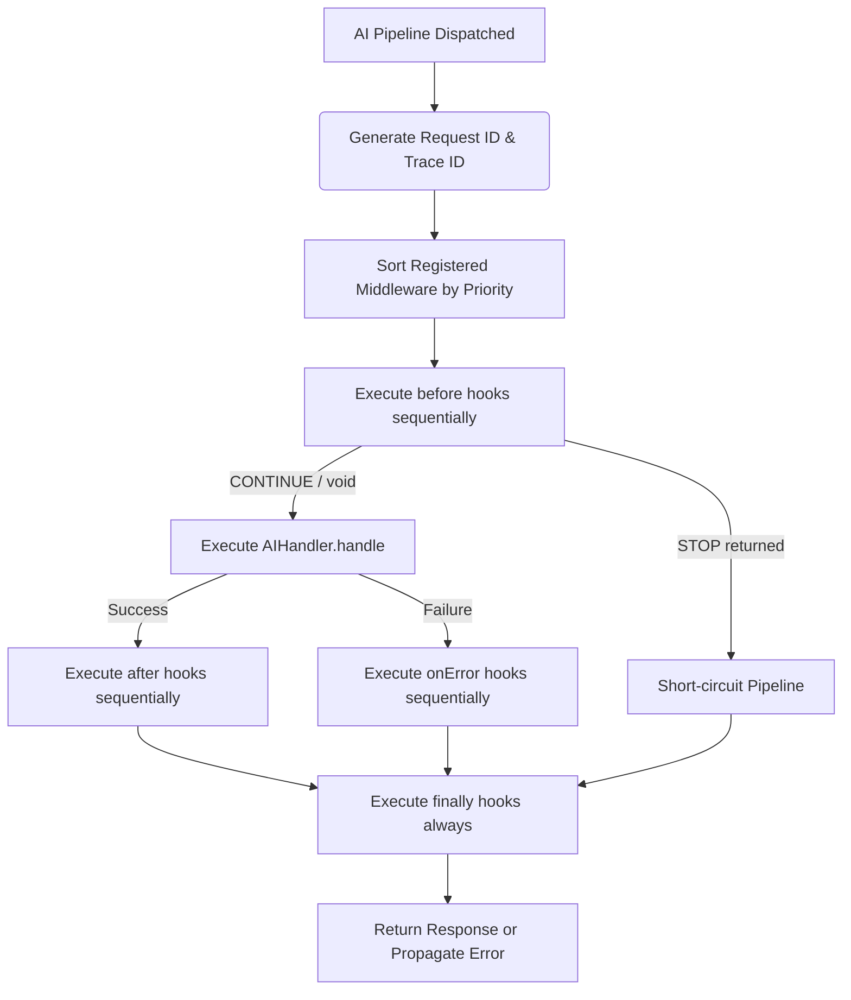

# AI Middleware Runtime (Sprint 4)

The AI Middleware Runtime is a provider-agnostic execution pipeline that sits between CreatorOS workflows and generative AI endpoints. It standardizes input validation, latency tracking, lifecycle logging, and real-time evaluations across all AI stages.

---

## Execution Flow Architecture

The middleware runner executes registered hooks sequentially based on priority weights.



---

## Lifecycle Hooks

Middlewares declare optional lifecycle methods:
1. **`before(context, request)`**: Runs before LLM generation. Can return `MiddlewareAction.STOP` to short-circuit the execution (useful for caching or guardrails).
2. **`after(context, request, response)`**: Runs after the handler returns a successful response.
3. **`onError(context, request, error)`**: Runs if the handler or after hooks encounter an exception.
4. **`finally(context, request)`**: Executes unconditionally at the end of every pipeline execution.

---

## Middleware Metadata & Sorting

* **Priority Matching**: Priority values (`number`) dictate execution order. Higher numbers run first.
* **Metadata Structure**: Each middleware exports metadata containing `name`, `version`, and `description`.
* **Trace Context Propagation**: Unique `traceId` and `requestId` are generated on init and passed through every hook.

---

## Built-In Middleware Classes

* **`TraceMiddleware`** (Priority 100): Generates unique `traceId` and `requestId` if absent.
* **`TimingMiddleware`** (Priority 90): Traces start/end execution timestamps, tracking millisecond durations.
* **`LoggingMiddleware`** (Priority 80): Standardized console logger output tracing execution events.
* **`EvaluationMiddleware`** (Priority 10): Receives an injected `EvaluationService` to run quality audits on generated drafts automatically.

---

## Usage Guide (Adding a Custom Middleware)

### 1. Create the Middleware
```typescript
import { AIMiddleware, AIRequest, AIContext, MiddlewareAction } from '@/ai/middleware';

export class PromptGuardMiddleware implements AIMiddleware {
  public metadata = {
    name: 'PromptGuard',
    version: '1.0.0',
    description: 'Intercepts toxic input words to protect upstream LLM usage.'
  };
  public priority = 95; // Runs right after tracing

  public before(context: AIContext, request: AIRequest): MiddlewareAction | void {
    if (request.prompt.includes('forbidden-word')) {
      // Short-circuit the run
      context.metadata.response = {
        content: 'Request blocked by PromptGuard policy constraint.',
        metadata: { blocked: true }
      };
      return MiddlewareAction.STOP;
    }
    return MiddlewareAction.CONTINUE;
  }
}
```

### 2. Execute via the Runner
```typescript
import { AIMiddlewareRunner, AIHandler } from '@/ai/middleware';
import { PromptGuardMiddleware } from './PromptGuard';

// Instantiate runner and register middlewares
const runner = new AIMiddlewareRunner();
runner.use(new PromptGuardMiddleware());

// Create a typed handler
class GeminiGenerationHandler implements AIHandler<AIRequest, AIResponse> {
  async handle(context, request) {
    const result = await callGeminiAPI(request.prompt);
    return { content: result };
  }
}

// Execute pipeline
const response = await runner.run(
  {
    creatorId: 'creator-123',
    stage: 'GENERATION',
    pipeline: 'generation',
    metadata: {}
  },
  {
    provider: 'Gemini',
    model: 'gemini-1.5-pro',
    prompt: 'Create a video intro.'
  },
  new GeminiGenerationHandler()
);
```

---

## Future Roadmap

1. **Sprint 5: CI/CD Evaluation Gate**
   * Pre-commit gates that block deployment if evaluation scores drop.
2. **Sprint 6: Production Pipeline Integration**
   * Connect middleware runner into CreatorOS Generation controllers on the backend.
