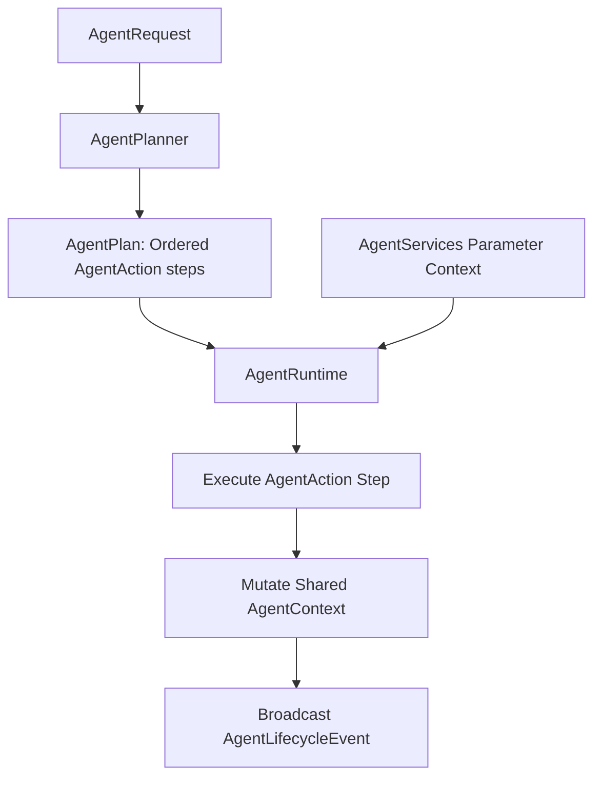

# AI Agent Runtime Orchestrator (Sprint 19)

A provider-agnostic, extensible agent reasoning runtime managing sequential action plans, mutating shared contexts, and broadcasting decoupled observability lifecycles.

---

## Architecture Overview

### 1. Extensible AgentAction Planners
`AgentPlanner` produces plans containing extensible `AgentAction` objects (specifying type strings and argument payloads). This dynamic layout supports future step types (`THINK`, `REPLAN`, `REFLECT`, `WAIT_FOR_USER`) without changing API interfaces or database tables.

### 2. Grouped Services Context
`AgentServices` acts as a parameters context encapsulating provider resolvers, vector stores, tools, streams, and evaluations into a single dependency, avoiding constructor parameter bloat.

### 3. Shared Context Mutations
All steps execute on a shared `AgentContext` recording retrieved memories, tool outputs, and evaluation metrics, passing state changes across step boundaries.

### 4. Decoupled Observability Tracing
The orchestrator emits lifecycle events (`AGENT_STARTED`, `AGENT_STEP_STARTED`, `AGENT_STEP_COMPLETED`, etc.) to registered `AgentLifecycleListener` instances. Observability modules subscribe to these event channels to publish traces without embedding trace-bus logic inside the runner.
