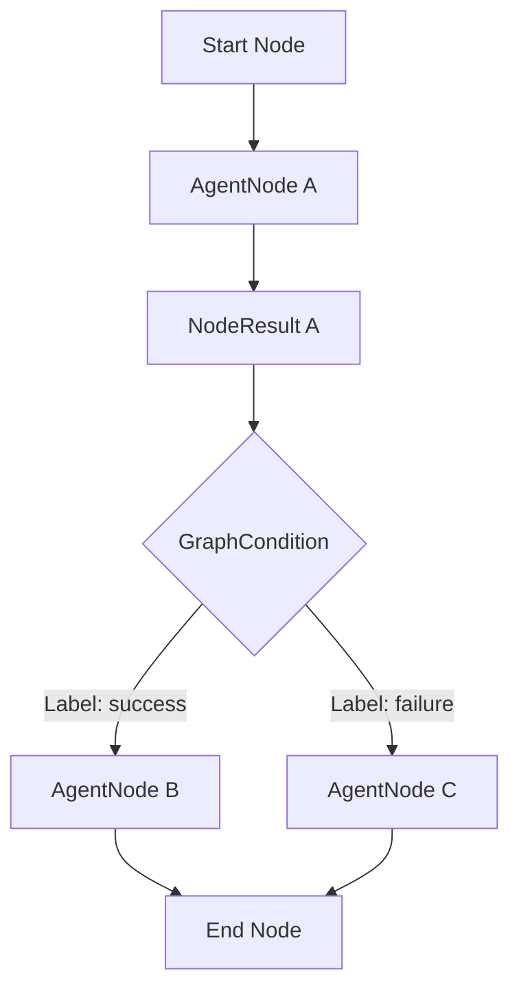

# Agent Graph Runtime (Sprint 20)

An extensible, provider-agnostic execution engine managing structured cycles, conditional branching, and loop validation checks in-memory.

---

## Architecture Overview

### 1. NodeResult Evaluators
Every executed `AgentNode` returns a structured `NodeResult` containing the execution status and output payload. Edge `GraphCondition` matchers evaluate this result directly to determine routing transitions rather than querying global context state.

### 2. Edge Routing Labels
Edges specify optional semantic labels (`success`, `failure`, `retry`, `fallback`) providing logical classification tags for workflow paths and visualization blocks.

### 3. Human-in-the-loop States
Exposes `GraphExecutionStatus` (`RUNNING`, `PAUSED`, `CANCELLED`, `COMPLETED`) mapping hook endpoints to enable future human-in-the-loop approval or state checkpoints.

### 4. Loop & Iteration Protection
Tracks real-time execution statistics (`nodesExecuted`, `transitionsTaken`, `duration`, `maxDepth`, `loopCount`). If visitation counts for any individual node cross the configured `maxIterations` threshold, execution terminates with `GRAPH_ITERATIONS_EXCEEDED` fail-open states to prevent infinite loop errors.
