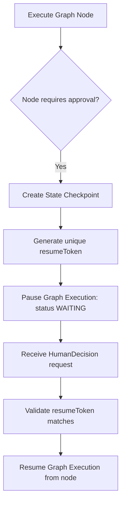

# Human-in-the-Loop (HITL) Runtime (Sprint 21)

A provider-agnostic Human-in-the-Loop runtime capturing execution checkpoints, supporting custom approval policies, and enabling secure node transitions using validation tokens.

---

## Workflow Integration

### 1. requiresHumanApproval Flag
Any `AgentNode` in the graph can specify `requiresHumanApproval?: boolean`. When true, execution pauses immediately before executing that node, saving progress.

### 2. Approval Policies
Execution resumption criteria are governed by policies (`SINGLE_APPROVER`, `ANY_APPROVER`, `ALL_APPROVERS`, `TIMEOUT`). The runtime validates credentials or durations before authorizing resumptions.

### 3. Checkpoint Status Lifecycle
* **WAITING**: The checkpoint is newly saved and is awaiting human decision inputs.
* **APPROVED**: Decision resolves successfully (the node executes using default or edited outputs).
* **REJECTED**: Decision rejects execution (resumes graph taking the failure transition edge path).
* **CANCELLED**: Aborts the active thread.
* **EXPIRED**: Timeout period elapsed.
* **RESUMED**: Checkpoint has successfully finished restarting execution.

### 4. secure resumeTokens
Generating a random `resumeToken` for every checkpoint ensures validation when external API endpoints or links resume executions.
