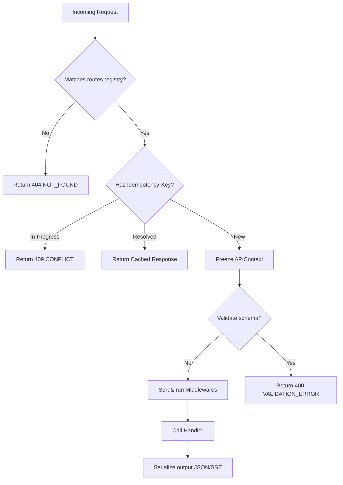

# API Gateway Runtime (Sprint 31)

A provider-agnostic, versioned, and priority-middleware driven API Gateway exposing all platform services under unified REST and streaming formats.

---

## Route Processing Pipeline

### 1. Priority MiddlewareRegistry
Allows registering middleware hooks with priority bounds:
* `TracingMiddleware` (priority = 100) -> injects Trace ID.
* `AuthMiddleware` (priority = 80) -> validates bearer tokens.
* `TenantMiddleware` (priority = 60) -> resolves organizations.

### 2. Standardized API Error Codes
Exposes standardized errors: `VALIDATION_ERROR`, `UNAUTHORIZED`, `FORBIDDEN`, `NOT_FOUND`, `CONFLICT`, `RATE_LIMITED`, `CANCELLED`, `TIMEOUT`, `PROVIDER_ERROR`, `INTERNAL_ERROR`.
