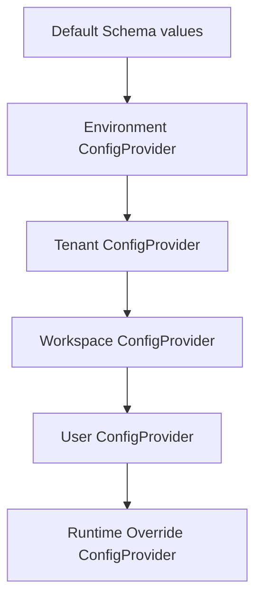

# Layered Configuration & Secrets Runtime (Sprint 30)

A secure, strongly validated, layered configuration orchestrator supporting pluggable secret resolution and heap-dump protection.

---

## Layered Precedence Order



### 1. In-Heap Secret Encryption
When retrieving values matching `${secret:SECRET_KEY}`, the runtime decodes it from the pluggable `SecretProvider` and caches it using AES-256-GCM. Plaintext secrets are decrypted on demand, preventing plain credentials from leaking in Node.js core heap dumps.

### 2. Nested Schema Verification
Allows setting objects validation layers:
```typescript
const schema = {
  database: {
    type: 'object',
    required: true,
    properties: {
      port: { type: 'number', required: true },
      host: { type: 'string', required: true }
    }
  }
};
```
If schema constraints are violated, the runtime instantly rejects and halts execution.
