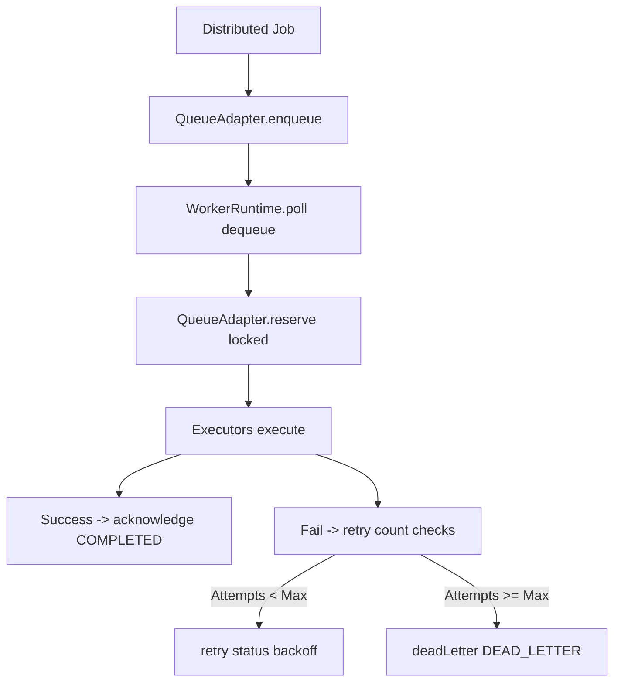

# Distributed Execution Runtime (Sprint 28)

A provider-agnostic distributed scheduling and task execution framework coordinating worker pools, reserve/release patterns, retry backoffs, and dead-letter queues under DISTRIBUTED_RUNTIME feature flags.

---

## Architecture Flow

### 1. States & Metrics
Traces jobs through stages (`QUEUED`, `RESERVED`, `RUNNING`, `COMPLETED`, `FAILED`, `RETRYING`, `CANCELLED`, `DEAD_LETTER`) while exporting metrics (`queueDepth`, `activeJobs`, `completed`, `failed`, `retries`).

### 2. Retry Backoffs
Supports fixed, linear, and exponential backoff calculations:
- `fixed`: stays static base interval.
- `linear`: expands base interval proportionally.
- `exponential`: doubles base interval exponentially.

### 3. Graceful Shutdown
Stops new dequeues, letting running items conclude before final worker pool shutdowns.
