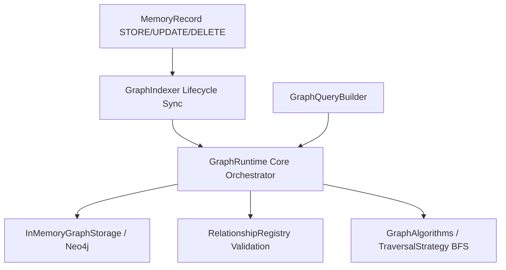

# Knowledge Graph Runtime (Sprint 23)

A provider-agnostic Knowledge Graph Runtime supporting decoupled storage, custom relationship types, extensible traversal strategies, and a fluent query builder.

---

## Architectural Layout

### 1. Decoupled Graph Storage
Decouples graph state mutation via a abstract `GraphStorage` interface. Default implementation is `InMemoryGraphStorage`, which handles cascading deletions of edges.

### 2. Extensible Relationship Registry
`RelationshipRegistry` manages valid directed relationship edge labels. Default registers include `CREATED`, `PREFERS`, `BELONGS_TO`, `REFERENCES`, `RELATED_TO`, and `WORKS_WITH`.

### 3. Traversal Strategies & Graph Algorithms
`GraphAlgorithms` computes path traversals (like finding shortest paths) over extensible `TraversalStrategy` interfaces, defaulting to `BFSTraversalStrategy`.

### 4. Fluent Query Builder
Provides a builder pattern to compile queries using chainable methods like `.filterNodeType('PROFILE').hasProperty('role', 'writing').limit(5).build()`.
