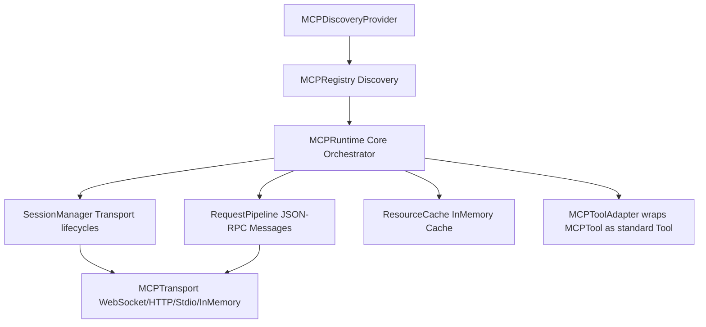

# Model Context Protocol (MCP) Runtime (Sprint 25)

A provider-agnostic MCP client-server Runtime supporting pluggable transport channels, capability registries, request pipelines, resource caches, and discovery providers.

---

## Architectural Schema

### 1. Pluggable Transports
Outsources connection channels to concrete classes implementing `MCPTransport` (Stdio, WebSocket, HTTP, and `InMemoryTransport` for local tests).

### 2. RequestPipeline
Handles serialization, transport delivery, validation boundaries, and JSON-RPC response resolutions.

### 3. Capability Registries
Monitors negotiated tool, resource, and prompt matrices via `MCPCapabilityRegistry`.

### 4. Discovery Providers
Decouples registry lookups using `MCPDiscoveryProvider` layers (like `RegistryDiscoveryProvider`).
