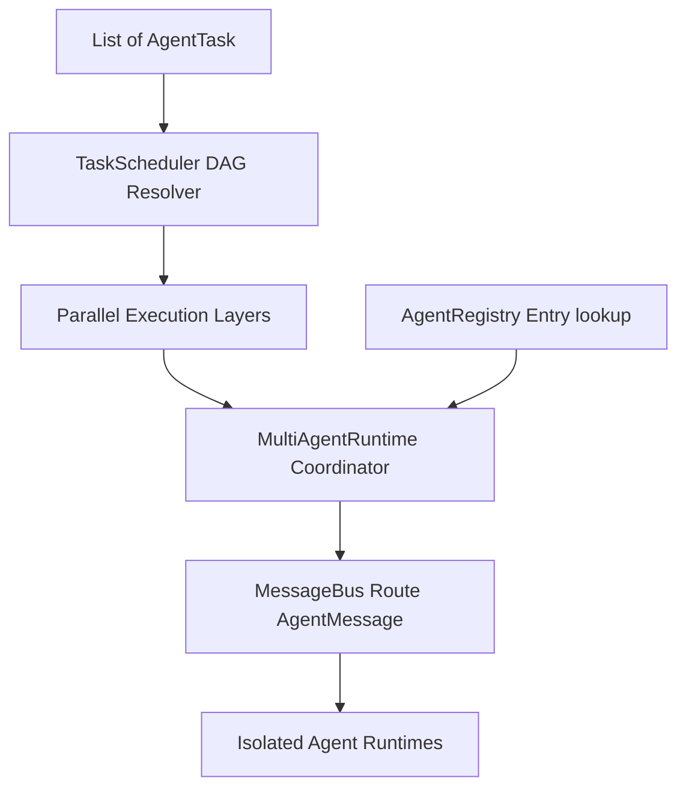

# Multi-Agent Coordination Runtime (Sprint 22)

A provider-agnostic Multi-Agent coordination engine executing dependency-based (DAG) task hierarchies with isolated agent environments and decoupled MessageBus routing.

---

## Architecture Overview

### 1. Isolated Agent Registry
`AgentRegistry` manages registering, discovering, enabling/disabling, and versioning agents. Each registered `AgentProfile` owns its isolated memory repo, tools context, model preferences, and evaluation thresholds.

### 2. Topological DAG Task Scheduler
`TaskScheduler` resolves dependencies dynamically to construct task execution layers. Sequential dependencies run across successive batches, while concurrent sibling branches are executed in parallel.

### 3. Decoupled MessageBus Communications
Replaces direct mutable shared state with immutable `AgentMessage` records passed through a central `MessageBus`, keeping agent interactions fully isolated and decoupled.

### 4. Graph Execution Policies
Enforces configurable coordination policies:
* **timeout**: Caps individual task execution duration in milliseconds.
* **maxRetries**: Re-runs failed tasks up to configured counts.
* **failFast**: Toggles whether a task error should immediately halt subsequent batches or continue on error.
