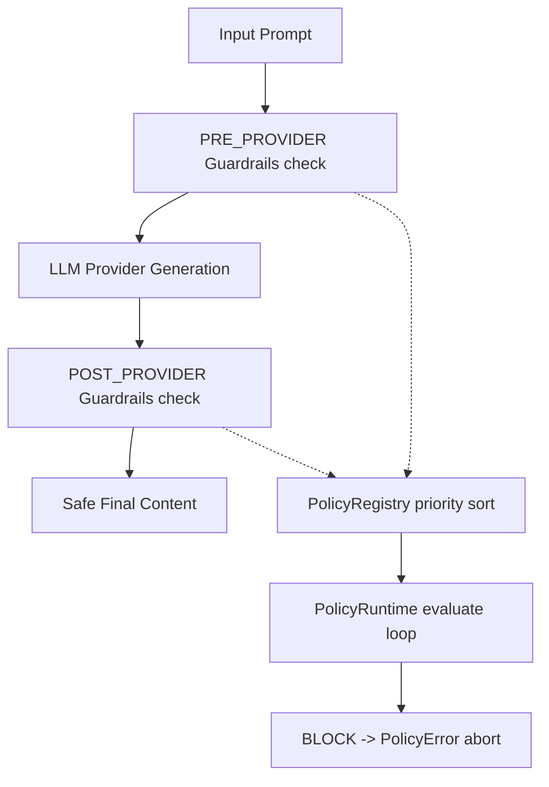

# Policy & Guardrails Runtime (Sprint 26)

A provider-agnostic policy validation runtime filtering LLM prompts and outputs across various connection stages under POLICY_RUNTIME feature flags.

---

## Architecture Flow

### 1. Stages & Severities
Enforces rules at multiple stages (`PRE_PROVIDER`, `POST_PROVIDER`, `PRE_TOOL`, `POST_TOOL`, `PRE_MEMORY`, `POST_MEMORY`) categorized by severity levels (`INFO`, `LOW`, `MEDIUM`, `HIGH`, `CRITICAL`).

### 2. Standardized Decisions
Processes policy evaluation checks returning:
- `ALLOW`: Lets payloads proceed.
- `BLOCK`: Throws standard `PolicyError` wrapping policy and reason parameters.
- `MODIFY`: Mutates content dynamically.
- `WARN`: Aggregates alert lists inside execution reports.

### 3. Fail-Open Safeguards
Traps policy execution exceptions, letting operations continue seamlessly (fail-open) to maintain generation service availability.
