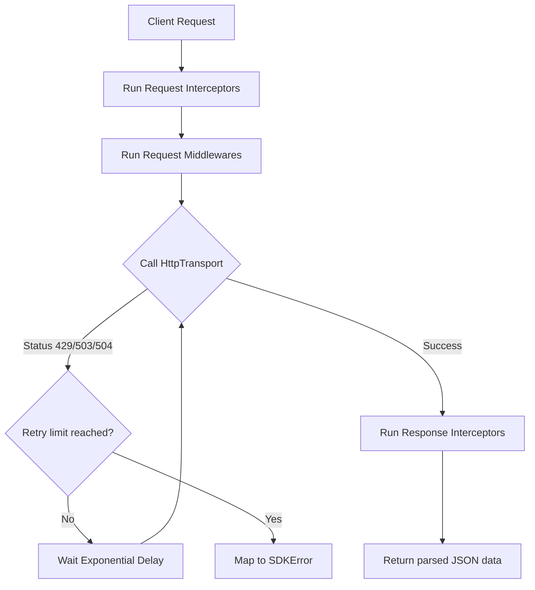

# SDK Client Runtime (Sprint 32)

A strongly typed client generator and execution pipeline supporting interceptor hooks, pluggable fetch transports, exponential backoffs, and Server-Sent Events (SSE) auto-reconnection with `Last-Event-ID` recovery.

---

## Client Execution Pipeline

### 1. Request & Response Interceptors
Interceptors run in linear sequence:
- `RequestInterceptor`: injects correlation ID headers or authentication headers.
- `ResponseInterceptor`: maps status codes or strips sensitive header values.

### 2. Auto-Reconnecting Server-Sent Events (SSE)
`SSEClientStream` decodes message boundaries, remembers the last incoming `id:`, and injects the `Last-Event-ID` header upon reconnecting during network drops.
