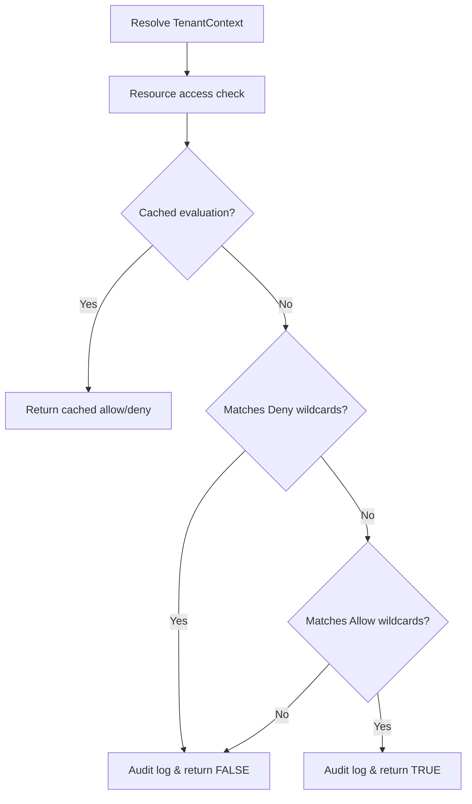

# Multi-Tenant & RBAC Security Runtime (Sprint 29)

A provider-agnostic tenant authorization and validation runtime supporting organizational resource separations, custom/inherited role sets, and temporal role expiries under MULTI_TENANT feature flags.

---

## Authorization Flow

### 1. ResourceScopes
Authorizations separate operations based on scope bindings:
- `GLOBAL`: system-wide resources.
- `TENANT`: organization boundaries.
- `WORKSPACE`: specific user project workspace boundaries.
- `USER`: private user data scopes.

### 2. Hierarchical Role Inheritance
Built-in and custom roles inherit lower-role clearances recursively:
`OWNER` > `ADMIN` > `DEVELOPER` > `REVIEWER` > `VIEWER`

### 3. Deny Overrides Policy
Allows defining custom `PermissionSet` filters where matching deny patterns override allow clearances completely.
