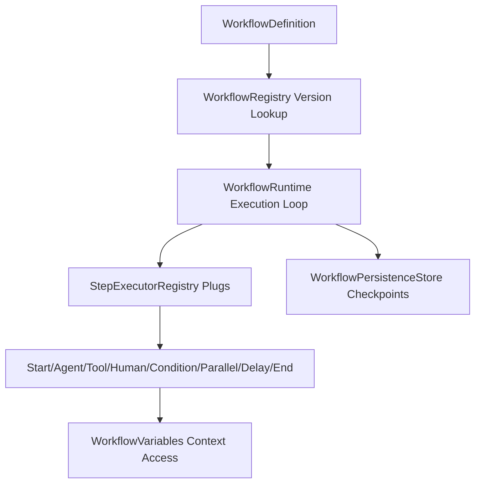

# Workflow Runtime (Sprint 24)

A provider-agnostic execution engine managing complex flow structures (START, AGENT, TOOL, HUMAN, CONDITION, PARALLEL, DELAY, END) using pluggable step executors and state persistence store checks.

---

## Architecture Layout

### 1. StepExecutorRegistry Plugins
Delegates execution strategies to concrete, registered `StepExecutor` interfaces. This makes adding custom steps fully pluggable and independent of the main loop.

### 2. WorkflowVariables Context Access
Encapsulates read/write properties inside `WorkflowVariables`, avoiding raw mutations to context tables and providing trace boundary security.

### 3. WorkflowPersistenceStore check
Persists execution state updates on disk/memory, supporting checkpoint pauses on `HUMAN` approval steps and resumptions.
